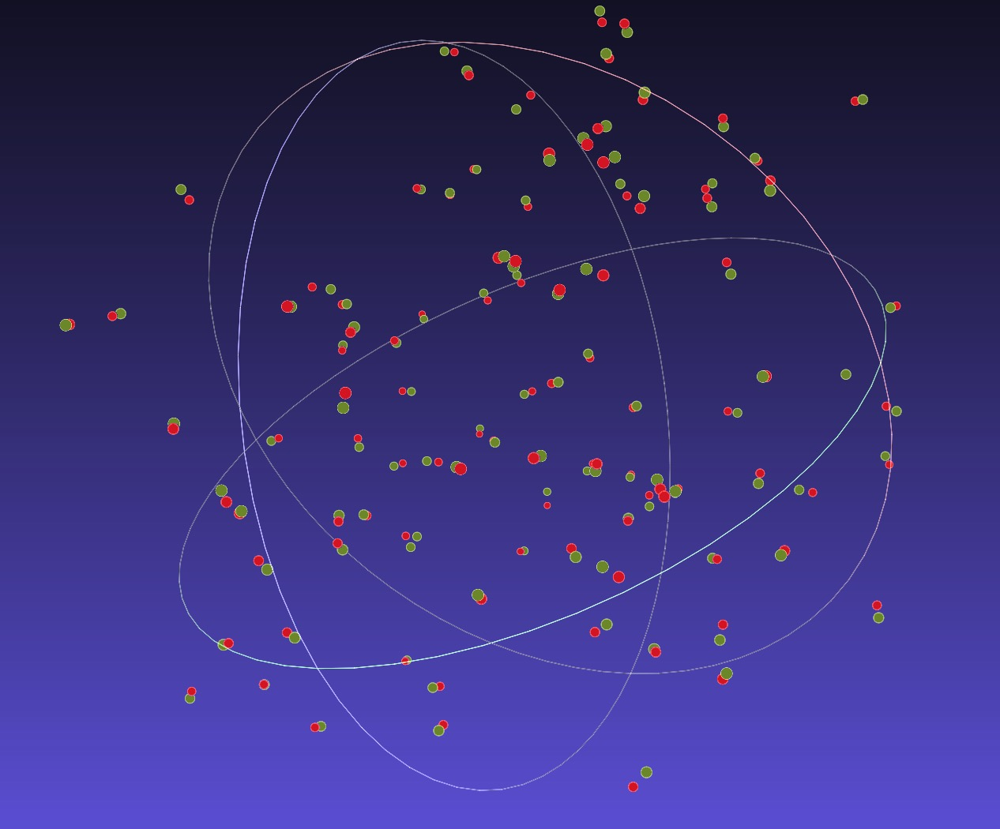
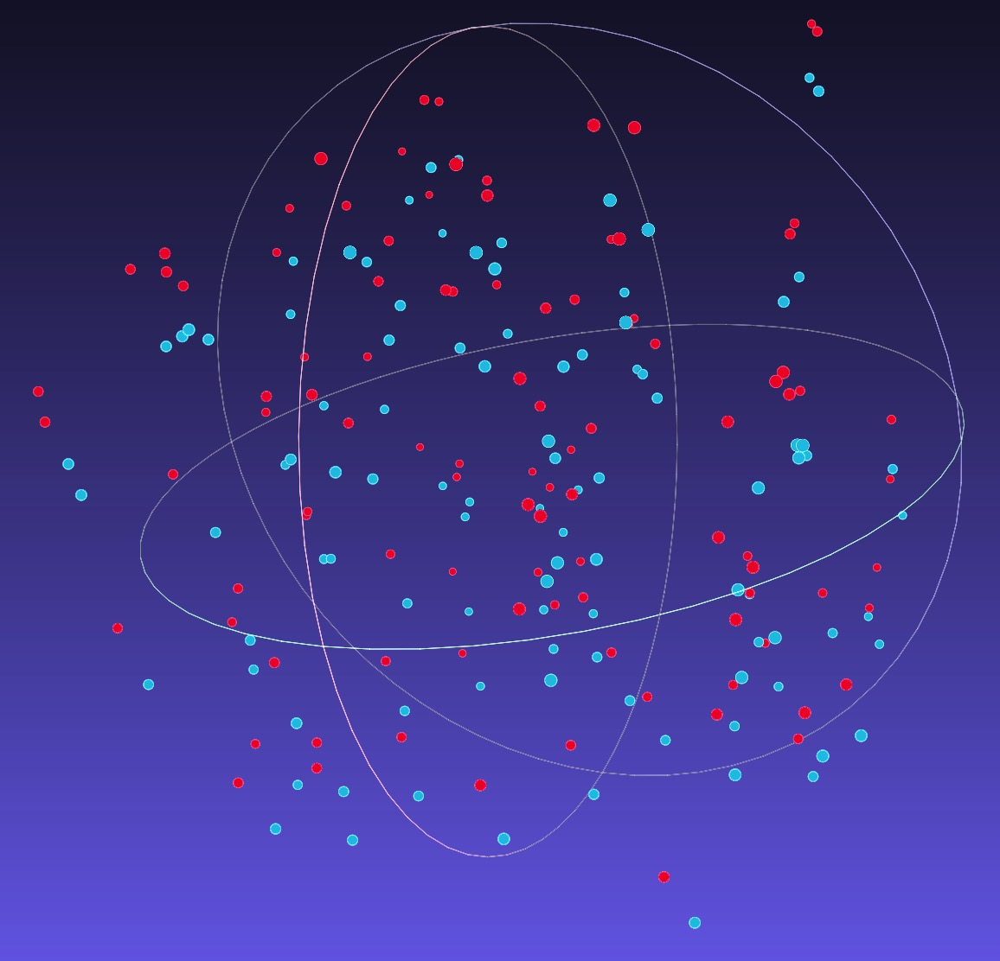
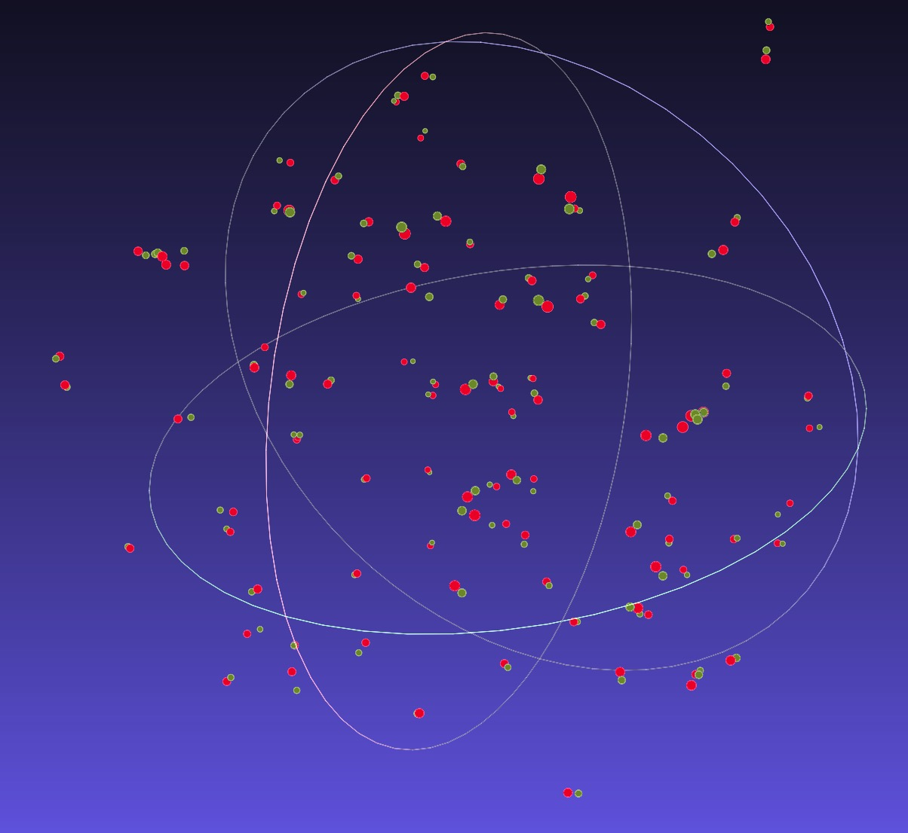

# Iterative Closest Point (ICP)

the implementation of ```iterative closest point``` algorithm based on python3.



# Installation 

- Python packages

        pip install -r requirements.txt

- Visualization tools

    We use free open source 3D digitization tools [Meshlab](https://www.meshlab.net/) to display result.
  
# Demo

- No Registration

  You need set ```Shuffle False``` in configuration file ```config/icp.yaml```. 

      python3 icp_demo.py


- Registration + ICP

    You need set ```Shuffle True``` in configuration file ```config/icp.yaml```.

      python3 icp_reg_demo.py

Three .off file will generate in ```output/``` folder. You can use [Meshlab](https://www.meshlab.net/) to display them.

# Result

- Init



- ICP Result

